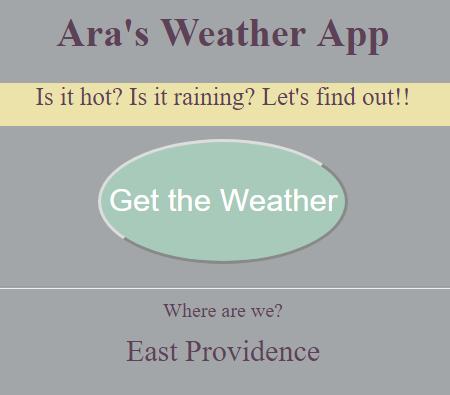

# Ara's Weather App



## This is Project 6 for CareerDevs

```javascript
console.log("Hello Providence Library");
```

#### Requirements:

1. Website should have a minimalistic yet professional feel:
  * Title for the page
  * Layout should be mobile friendly
2. Location should be pulled automatically. Use the Project Page to see two ways to do this. Using C9 provides you with an HTTPS connection so you should be able to use HTML5 geolocation system.
3. The local weather for the day should be displayed:
  * Weather should display the type of weather: sunny, rainy, cloudy etc
  * Weather should display an icon or image depending on the type of weather - recommendation is to use FontAwesome but you can use whatever icon/image system you wish.
  * Weather should display current temperature
  * Current weather section should allow a click to change from Fahrenheit to Celsius. This could be a button or some other method.
4. Weather must be pulled from an API. Recommended API is the open Weather API however you are free to use any weather API you wish.

#### What I Learned:

1. How easy is it to find the user's location?
  * I was aware of this but had rarely used it.  

```javascript
var x = document.getElementById("demo");
function getLocation() {
    if (navigator.geolocation) {
        navigator.geolocation.getCurrentPosition(showPosition);
    } else {
        x.innerHTML = "Geolocation is not supported by this browser.";
    }
}
function showPosition(position) {
    x.innerHTML = "Latitude: " + position.coords.latitude +
    "<br>Longitude: " + position.coords.longitude;
}
```

## Link to the site: https://murphypicard.github.io/weatherAPIproject6/
